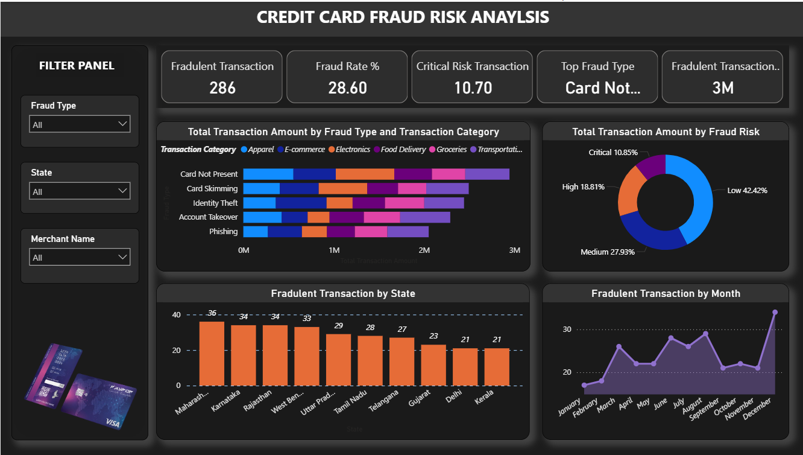

# 💳 Credit Card Fraud Risk Analysis Power BI Project 

* This end-to-end Power BI project focuses on detecting and analyzing credit card fraud using real-world transaction data. It covers data cleaning, exploratory data analysis (EDA), interactive dashboard creation, and risk assessment metrics. The project highlights how banks and financial institutions can leverage data visualization and analytics to identify fraudulent patterns, assess high-risk transactions, and support data-driven fraud prevention strategies.
---

## 🛠️ Tools & Technologies Used

* **Power BI Desktop**
* **Microsoft Excel / CSV Data Files**
* **Data Cleaning (Power Query)**
* **Data Modeling (Relationships, DAX, Measures)**
* **Visualizations (Bar Charts, Cards, Slicers, Maps, KPI)**

---

## 📌 Key Features of the Dashboard

* 📍 **Fraud Heatmap by Region** – See where fraud is most common
* 🧮 **Transaction Summary** – Total volume vs. fraud ratio
* 📈 **Risk Score Analysis** – Identify high-probability fraud cases
* ⏳ **Time-based Trend Analysis** – Fraud patterns by day/week/hour
* ⚠️ **High-Risk Alerts** – Automatically flag risky transactions
* 📂 **Filters and Drilldowns** – Explore data by merchant, region, amount, etc.

---

## 📷 Preview of the Dashboard

---

## 🚀 Conclusion

This Power BI project showcases how **data visualization and analysis** can significantly aid in **fraud detection and prevention** in the financial industry. Through dashboards, risk scoring, and anomaly detection, we can make smarter, data-driven decisions to combat fraudulent activities.

---

## ⭐ If you found this project useful...

Please consider giving it a ⭐ and sharing it with others!

---
